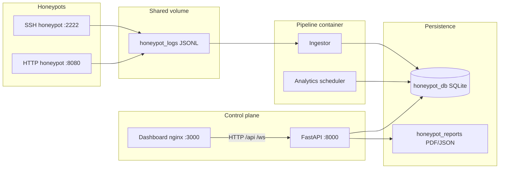

# Honeypot Analysis Platform

A **containerized deception and analytics stack** that emulates SSH and HTTP attack surfaces, streams structured telemetry into a **SQLite** warehouse, runs **ingestion, alerting, and scheduled analytics**, and exposes a **JWT-protected FastAPI backend** plus a **React command-center dashboard**. The same codebase powers local development (Python 3.11+ / Node 20) and production-like **Docker Compose** orchestration.

---

## What This System Does

1. **SSH honeypot** — AsyncSSH-based server that accepts interactive shells, records credentials and commands, and writes **JSON Lines** to shared logs.
2. **HTTP honeypot** — aiohttp application with faux admin/login routes, fingerprinting, and JSONL logging.
3. **Pipeline** — Background **log ingestor** (parses `ssh.jsonl` / `http.jsonl`, enriches with GeoIP hooks, materializes rows into SQLite) and **analytics scheduler** (periodic scoring, feed trimming, alert hooks).
4. **Alerting** — Rule engine (`alerting/rules.py`) evaluates ingestion payloads and can dispatch to email, Slack, or webhooks (`alerting/channels/`).
5. **API** — FastAPI service with OAuth2-style **login**, JWT access/refresh, REST routers for intelligence endpoints, and a **WebSocket** live feed.
6. **Dashboard** — Vite + React 18 SPA (Tailwind, React Query, Zustand, Recharts, Leaflet) served by nginx, proxying `/api` and `/ws` to the API service.

---

## Architecture



**Startup order (Compose):** SSH and HTTP honeypots become **healthy** (TCP checks) → **pipeline** opens the DB and runs ingestor + scheduler → **API** initializes SQLAlchemy models and serves traffic → **dashboard** waits for API health, then starts.

---

## Repository Layout

| Path | Role |
|------|------|
| `docker-compose.yml` | Five services, named volumes, health checks, `env_file: .env` |
| `honeypots/` | Shared `BaseHoneypot` config, `ssh/` (AsyncSSH + fake shell), `http/` (aiohttp + templates) |
| `pipeline/` | SQLAlchemy **2.0 async** models, `database.py`, `ingestor.py`, `enricher.py`, `geoip.py`, `logger.py`, **Alembic** under `pipeline/alembic/` |
| `analytics/` | Scheduled cycles (`engine.py`, `scheduler.py`), reports (`reporter.py`), payload taxonomy (`payloads.py`), helpers (`patterns.py`, `credentials.py`, …) |
| `alerting/` | `engine.py` (batch + periodic hooks), `rules.py`, `channels/` (email, Slack, webhook, dispatch) |
| `api/` | FastAPI `main.py`, `auth.py`, `dependencies.py`, `schemas.py`, `websocket.py`, `routers/*` |
| `dashboard/` | `package.json`, Vite config, Tailwind, `src/` (pages, store, API client, hooks) |
| `scripts/` | `seed_demo_data.py` — idempotent demo sessions/feed rows |
| `honeypot-platform/` | Legacy/supplementary tree (older copies of some files, `.env.example`); **canonical runtime layout is the repository root** |

---

## Prerequisites

- **Docker** and **Docker Compose** (BuildKit-capable recommended).
- For local dev without Docker: **Python 3.11+** (3.13 works with pinned deps), **Node.js 20+** for the dashboard.

---

## Quick Start (Docker)

1. **Clone** and enter the project root (the folder that contains `docker-compose.yml`).

2. **Create `.env`** at the project root. Minimum for the API:

   ```bash
   API_SECRET_KEY=<at-least-16-chars-use-a-long-random-string>
   ADMIN_USERNAME=admin
   ADMIN_PASSWORD=<your-secure-password>
   ```

   Optional variables match `honeypot-platform/.env.example` (ports, GeoIP path, SMTP, Slack, CORS, etc.). See [Environment variables](#environment-variables).

3. **Database URL in Docker:** Do **not** set `DATABASE_URL` unless you know you need an override. The application defaults to an **absolute** SQLite file under `/app/data/honeypot.db` inside containers (see `pipeline/database.py`). Setting `DATABASE_URL=sqlite+aiosqlite:///./data/honeypot.db` can break the API when the process working directory is not the project root.

4. **Build and run:**

   ```bash
   docker compose up -d --build
   ```

5. **Verify:**

   ```bash
   curl -s http://localhost:8000/api/health
   # {"status":"ok","version":"1.0.0"}

   curl -s -o /dev/null -w "%{http_code}\n" http://localhost:3000/
   # 200
   ```

6. **Seed demo rows** (optional):

   ```bash
   docker compose exec pipeline python /app/scripts/seed_demo_data.py
   ```

7. **Open the dashboard** at `http://localhost:3000`, log in with `ADMIN_USERNAME` / `ADMIN_PASSWORD`, and explore Sessions, Attackers, Payloads, Alerts, and Reports.

---

## Docker Services

| Service | Image context | Ports (defaults) | Volumes / notes |
|---------|---------------|------------------|-----------------|
| `ssh-honeypot` | `honeypots/ssh/Dockerfile` | `2222` | `honeypot_logs` → `/app/logs` |
| `http-honeypot` | `honeypots/http/Dockerfile` | `8080` | same logs volume |
| `pipeline` | `pipeline/Dockerfile` | — | `honeypot_logs`, `honeypot_db` → `/app/data`; ingestor + scheduler entrypoint |
| `api` | `api/Dockerfile` | `8000` | `honeypot_db`, `honeypot_reports` → `/app/reports`; root **entrypoint** fixes volume ownership then runs **uvicorn** as user `honeypot` |
| `dashboard` | `dashboard/Dockerfile` | `3000` → nginx `80` | Proxies `/api` and `/ws` to `api:8000` (see `dashboard/nginx.conf`) |

**Named volumes:** `honeypot_db` (SQLite), `honeypot_logs` (JSONL shared by honeypots + pipeline—avoids host bind-mount permission issues with non-root users), `honeypot_reports` (generated PDFs/JSON bundles).

---

## Environment Variables

The API reads settings via **pydantic-settings** from `.env` (see `api/dependencies.py`). Common entries (full template: `honeypot-platform/.env.example`):

| Variable | Purpose |
|----------|---------|
| `API_SECRET_KEY` | **Required.** JWT signing secret (min 16 characters). |
| `API_ALGORITHM` | JWT algorithm (default `HS256`). |
| `ACCESS_TOKEN_EXPIRE_MINUTES` / `REFRESH_TOKEN_EXPIRE_DAYS` | Token lifetimes. |
| `ADMIN_USERNAME` / `ADMIN_PASSWORD` | Dashboard/API login (OAuth2 password flow at `POST /api/auth/login`). |
| `CORS_ORIGINS` | Comma-separated browser origins (e.g. `http://localhost:3000`). |
| `DATABASE_URL` | Optional override for SQLAlchemy async URL; omit in Compose to use computed absolute SQLite path. |
| `REPORTS_DIR` | API container: defaults to `/app/reports` (see `api/Dockerfile` `ENV`). |
| `LOG_DIR` / `INGEST_*` / `ANALYTICS_*` | Pipeline and honeypot logging and polling tuning. |
| `GEOIP_DB_PATH` | Optional MaxMind City database for enrichment. |
| `ALERT_*` | Email, Slack, webhook toggles and thresholds. |

Ports are overridden via `SSH_HONEYPOT_PORT`, `HTTP_HONEYPOT_PORT`, `API_PORT`, `DASHBOARD_PORT` in Compose or `.env`.

---

## HTTP API Overview

Base URL in Docker from the host: `http://localhost:8000`. Routers are mounted under `/api` except the WebSocket app, which is mounted at `/ws`.

| Area | Prefix | Auth |
|------|--------|------|
| Auth | `/api/auth` (login, refresh) | Public for login/refresh |
| Dashboard stats | `/api/stats` | Bearer JWT |
| Sessions | `/api/sessions` | Bearer JWT |
| Attackers | `/api/attackers` | Bearer JWT |
| Payloads | `/api/payloads` | Bearer JWT |
| Alerts | `/api/alerts` | Bearer JWT |
| Reports | `/api/reports` (generate, list, download PDF) | Bearer JWT |
| Honeypots status | `/api/honeypots` | Bearer JWT |
| Health | `GET /api/health` | Public (used by Docker health check) |

**WebSocket:** `GET /ws/live-feed?token=<access_jwt>` — JWT query parameter for browser clients; streams `FeedEvent` rows (with periodic `{ "type": "ping" }` keep-alives) and uses an in-memory connection manager for optional `broadcast_feed_event` use from the API process.

---

## Dashboard

- **Stack:** React 18, TypeScript, Vite 6, Tailwind CSS 3, TanStack Query, Zustand (persisted auth), Recharts, react-leaflet, react-hot-toast.
- **API client:** Axios instance with `baseURL: "/api"`, `Authorization: Bearer …` from the store, `401` clears auth and redirects to `/login`.
- **Routes:** `/login`, `/` (overview), `/sessions`, `/attackers`, `/payloads`, `/alerts`, `/reports` (protected).

Local UI development (API must be reachable, often via Vite proxy):

```bash
cd dashboard && npm install && npm run dev
```

---

## Data Model & Database

- **ORM:** SQLAlchemy 2.0 declarative style with `Mapped` / `mapped_column` (`pipeline/models.py`).
- **Engine:** Async SQLite via `aiosqlite`; session factory in `pipeline/database.py`.
- **Migrations:** Alembic configuration lives under `pipeline/alembic/` with `pipeline/alembic.ini`. `pipeline/alembic/env.py` imports `DATABASE_URL` from `pipeline.database` for consistency.
- **Bootstrap:** On API startup, `init_models()` creates missing tables (`api/main.py` lifespan).

---

## Reports

`analytics/reporter.py` builds JSON summaries and optional **ReportLab** PDFs under `REPORTS_DIR`. The API exposes generation and download (`GET /api/reports/{id}/download`). Charts depend on **matplotlib** when available.

---

## Local Python Development

```bash
python3 -m venv .venv
source .venv/bin/activate   # or .venv\Scripts\activate on Windows
pip install -r api/requirements.txt
export PYTHONPATH="$PWD"
export API_SECRET_KEY="<long-random-secret>"
uvicorn api.main:app --app-dir . --reload --host 0.0.0.0 --port 8000
```

Run from the **repository root** so `PYTHONPATH` resolves `pipeline`, `api`, `analytics`, and `alerting`. Use a local SQLite path you can write to, or set `DATABASE_URL` explicitly.

---

## Operations Cheat Sheet

| Task | Command |
|------|---------|
| Stack logs | `docker compose logs -f` |
| API shell | `docker compose exec api runuser -u honeypot -- /bin/sh` |
| Re-seed DB | `docker compose exec pipeline python /app/scripts/seed_demo_data.py` |
| Inspect DB volume | `docker volume inspect honeypotproject_honeypot_db` |

Backup: copy the SQLite file from the named volume or use `docker compose exec api` with `sqlite3` if installed.

---

## Security and Production Notes

- Change **all** default passwords and `API_SECRET_KEY` before any internet-facing deployment.
- Honeypots **intentionally accept** interaction; isolate them on DMZ VLANs or lab networks.
- JWTs are **stateless**; rotate secrets with a maintenance window if compromised.
- Email/Slack/webhook credentials belong only in `.env` or a secrets manager—never commit them.

---

## License and Contributing

Add your license and contribution guidelines here if you publish the repository.

---

## Summary

This repository is a **full-stack honeypot intelligence platform**: capture → ingest → store → alert → API → dashboard, with **one-command Docker Compose** startup, **health-checked** dependencies, and a **single SQLite database** as the system of record for sessions, payloads, alerts, feed events, and reports.
